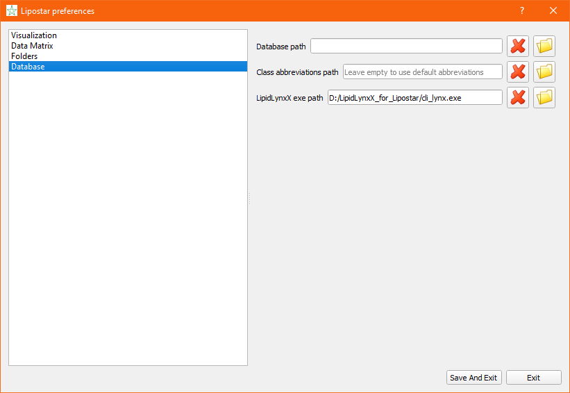

# StarCats
## epilipidomics tools for Lipostar 2 developed by Team SysMedOs

This repository contains special version of epilipidomics tools which can be used with Lipostar 2 software.

+ ### LipidLynxX

  

  + The LipidLynxX project is aimed to provide a unified identifier for major lipids, especially oxidized lipids in the epilipidome.
  + Project repository: https://github.com/SysMedOs/LipidLynxX
  + Publication: [Zhixu Ni, Maria Fedorova. "LipidLynxX: a data transfer hub to support integration of large scale lipidomics datasets"](https://www.sciencedirect.com/science/article/pii/S0891584919303466)
  + DOI: [10.1016/j.freeradbiomed.2019.04.027](https://www.sciencedirect.com/science/article/pii/S0891584919303466)

+ ### LPPtiger

  

  + LPPtiger is a pioneer in the field of high-throughput identification of oxidized lipids (epilipids).
  + Project repository: https://github.com/SysMedOs/lpptiger
  + Publication: [Ni, Zhixu, Georgia Angelidou, Ralf Hoffmann, and Maria Fedorova. "LPPtiger software for lipidome-specific prediction and identification of oxidized phospholipids from LC-MS datasets." Scientific Reports 7, Article number: 15138 (2017).](https://www.nature.com/articles/s41598-017-15363-z)
  + DOI: [10.1038/s41598-017-15363-z](https://www.nature.com/articles/s41598-017-15363-z)

## About Lipostar 2

Lipostar is the latest software from Molecular Discovery, developed to assist LC/MS-based lipidomics from the very beginning (direct import of raw data files) to the final goal (lipid identification, statistical analysis, report generation).

+ Publication: [Goracci L; Tortorella S; Tiberi P; Pellegrino RM; Di Veroli A; Valeri A; Cruciani G, Lipostar, a Comprehensive Platform-Neutral Cheminformatics Tool for Lipidomics. Anal. Chem., 2017, 89 (11), pp 6257–6264](https://pubs.acs.org/doi/10.1021/acs.analchem.7b01259)
+ DOI: [10.1021/acs.analchem.7b01259](https://doi.org/10.1021/acs.analchem.7b01259)

Read more about Lipostar:

https://www.moldiscovery.com/software/lipostar/

## Download epilipidomics tools for Lipostar

Please find the latest .exe version in the release page.

## Instructions

+ ### LipidLynxX

  + Download the `.zip` package
  + unzip it into a folder
  + start Lipostar 2 
  + open Lipostar perferences
  + set the path of `cli_lynx.exe` in Lipostar perferences
    

+ ### LPPtiger

  + download the `.zip` package

  + unzip it into a folder

  + find the `LPPtiger.exe` to star the GUI of LPPtiger for Lipostar 2

    

  + load the `.csv` exported from Lipostrar2 for LPPtiger and set  parameters on the GUI of LPPtiger and click on "Run analysis"

  + run status will be displayed on the GUI, wait until the run finish.

    

  + the output `.csv` file can be imported back to Lipostar 2

